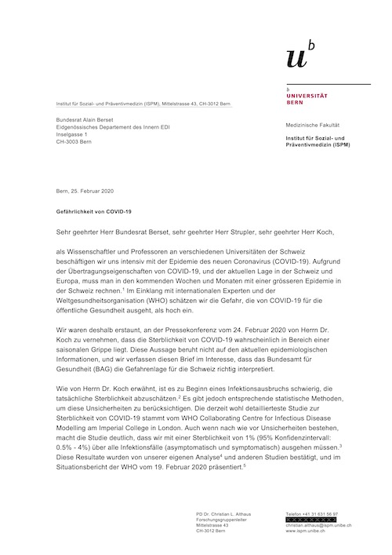

# brief-bundesrat-covid19

### Brief an Bundesrat Alain Berset (Eidgenössisches Departement des Innern, EDI), Pascal Strupler (Direktor Bundesamt für Gesundheit, BAG) und Daniel Koch (Leiter Abteilung Übertragbare Krankheiten, BAG) vom 25. Februar 2020 bezüglich Gefährlichkeit von COVID-19

Unterzeichnet von:
- PD Dr. Christian L. Althaus (Universität Bern)
- Dr. Emma Hodcroft (Universität Basel)
- Prof. Dr. Richard Neher (Universität Basel)
- Prof. Dr. Marcel Salathé (EPFL)

